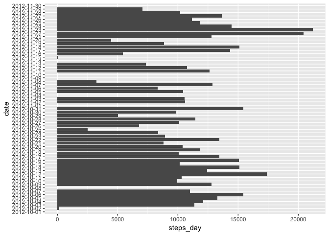
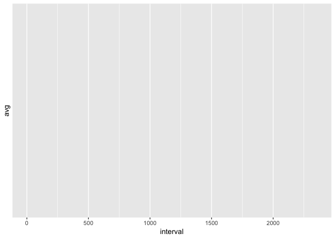
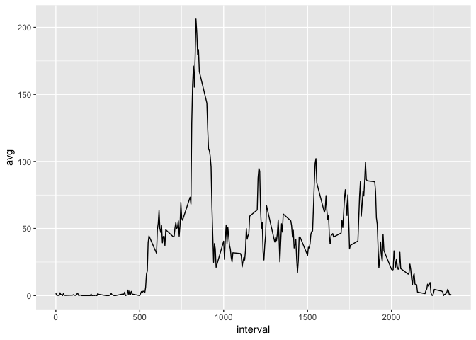
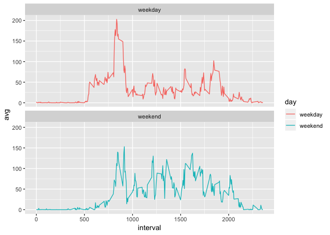

Assessment Course 5 Project 1
=============================

This script collects data from an activity monitoring device and explore
data on steps. The sequence of analysis is:

Loading the data
----------------

    activity <- read.csv("activity.csv")

Mean total number of steps taken per day
----------------------------------------

To answer this question, data are grouped by date, the sum of steps per
day is computed and the information is plotted. Coordenates are flipped
in order to show tidier date labels. After that, mean and median are
calculated. As NA values have been ignored and not removed, for dates
with intervals containing NAs, the sum is NA and ggplot\_col gives a
warning saying 8 rows have been remove (meaning there are 8 days with
NAs) These 8 days are shown as empty bars in the plot. Mean and Median
throw NA as any computational operation involving NAs give NA.

    days <- group_by(activity, date) 
    daily <- summarise(days, steps_day=sum(steps))

    (ggplot(daily)+geom_col(mapping=aes(x=date, y=steps_day))+coord_flip())

    ## Warning: Removed 8 rows containing missing values (position_stack).

    (steps_day_mean <- mean(daily$steps_day))

    ## [1] NA

    (steps_day_median <- median(daily$steps_day))

    ## [1] NA

Average daily activity pattern
------------------------------

To see the daily activity pattern, a time series plot is tried to be
drawn based on 5 min intervals. For that, now grouping is done by
intervals and mean of steps is calculated for each interval

    intervals <- group_by(activity, interval)
    intervaly <- summarise(intervals, avg=mean(steps))

    (ggplot(intervaly)+geom_line(mapping=aes(x=interval, y=avg)))

    ## Warning: Removed 288 rows containing missing values (geom_path).

What happened? We see a warning saying that 288 rows have been removed
(actually all the interval groups) meaning that as there are NA for all
the intrevals, mean stat will be NA, and therefore graph will be empty.

Obviously, a determination of which interval on average across all the
days contains the maximum number of steps will throw same empty result:

    (interval_max <- intervaly$interval[which.max(intervaly$avg)])

    ## integer(0)

If we do the same but just we explicit na.rm=true when we try to
calculate mean steps:

    intervaly <- summarise(intervals, avg=mean(steps, na.rm=TRUE))

Now, when we plot intervals serie, we can see pattern and calculate
interval in which maximum number of steps are taken:

    (ggplot(intervaly)+geom_line(mapping=aes(x=interval, y=avg)))

    (interval_max <- intervaly$interval[which.max(intervaly$avg)])

    ## [1] 835

Imputing missing values
-----------------------

I assume that when there are no available data, the best way to minimize
noise is to consider 0 steps for that period. With code below we
determine number of NA (we saw before distributed in 8 different days)
and we set them to 0 in a new data set named activity\_narm:

    (na <- length(activity$steps[is.na(activity$steps)]))

    ## [1] 2304

    activity_narm <- activity
    activity_narm$steps[is.na(activity_narm$steps)]=0 

If same analysis as before is performed now regarding total number of
steps taken per day as well as total mean and median all across days:

    days_narm <- group_by(activity_narm, date) 
    daily_narm <- summarise(days_narm, steps_day=sum(steps))

    (ggplot(daily_narm)+geom_col(mapping=aes(x=date, y=steps_day))+coord_flip())

    (steps_day_mean_narm <- mean(daily_narm$steps_day))

    ## [1] 9354.23

    (steps_day_median_narm <- median(daily_narm$steps_day))

    ## [1] 10395

if we check how many days have 0 steps:

    (filter(daily_narm, daily_narm$steps_day == 0))

    ## # A tibble: 8 x 2
    ##   date       steps_day
    ##   <fct>          <dbl>
    ## 1 2012-10-01         0
    ## 2 2012-10-08         0
    ## 3 2012-11-01         0
    ## 4 2012-11-04         0
    ## 5 2012-11-09         0
    ## 6 2012-11-10         0
    ## 7 2012-11-14         0
    ## 8 2012-11-30         0

We see that there are 8 complete days with 0 steps, what means that all
intervals for these days had NAs. Just because of this, there is no
difference in the plot (8 empty rows because of NAs and 8 empty rows
beacuse of 0 steps)

Differences in activity patterns between weekdays and weekends
--------------------------------------------------------------

We want to figure out if there is any change in activity patterns
depending on whether it's weekday o weekend. We create a new variable to
classify observations in weekday or weekend:

    activity_narm <- mutate(activity_narm, day=weekdays(as.Date(activity$date)))
    for (i in 1:length(activity_narm$day)) {
            if (activity_narm$day[i] %in% c("lunes", "martes", "miércoles", "jueves", "viernes")) {
                    activity_narm$day[i]="weekday"} 
            else {
                    activity_narm$day[i]="weekend"}
            }

Data are grouped now by day and interval; mean steps are calculated by
days and plotted using facets to differentiate between weekdays and
weekends:

    intervals <- group_by(activity_narm, day, interval)
    intervaly <- summarise(intervals, avg=mean(steps))

    (ggplot(intervaly)+geom_line(mapping=aes(x=interval, y=avg, color=day))+facet_wrap(~ day, nrow=2))

